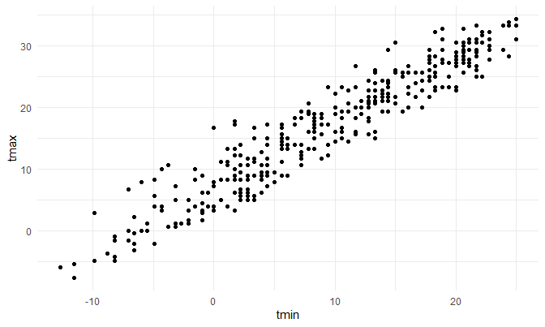

Homework \#6
================
David Nemirovsky
12/9/20

## **Problem 1**

``` r
homicide_df = 
  read_csv("./data/homicide-data.csv") %>% 
  mutate(
    city_state = str_c(city, state, sep = ", "),
    victim_age = as.numeric(victim_age),
    resolution = case_when(
      disposition == "Closed without arrest" ~ 0,
      disposition == "Open/No arrest" ~ 0,
      disposition == "Closed by arrest" ~ 1
    )
  ) %>% 
  filter(
    victim_race %in% c("Black", "White"),
    city_state != "Tulsa, AL") %>% 
  select(city_state, resolution, victim_age, victim_race, victim_sex)
```

    ## Parsed with column specification:
    ## cols(
    ##   uid = col_character(),
    ##   reported_date = col_double(),
    ##   victim_last = col_character(),
    ##   victim_first = col_character(),
    ##   victim_race = col_character(),
    ##   victim_age = col_character(),
    ##   victim_sex = col_character(),
    ##   city = col_character(),
    ##   state = col_character(),
    ##   lat = col_double(),
    ##   lon = col_double(),
    ##   disposition = col_character()
    ## )

    ## Warning: Problem with `mutate()` input `victim_age`.
    ## i NAs introduced by coercion
    ## i Input `victim_age` is `as.numeric(victim_age)`.

    ## Warning in mask$eval_all_mutate(dots[[i]]): NAs introduced by coercion

Start with one city:

``` r
baltimore_df = 
  homicide_df %>% 
  filter(city_state == "Baltimore, MD")

glm(resolution ~ victim_age + victim_race + victim_sex,
    data = baltimore_df,
    family = binomial()) %>% 
  broom::tidy() %>% 
  mutate(
    OR = exp(estimate),
    CI_lower = exp(estimate - 1.96 * std.error),
    CI_upper = exp(estimate + 1.96 * std.error)
  ) %>% 
  select(term, OR, CI_lower, CI_upper) %>% 
  knitr::kable(digits = 3)
```

| term              |    OR | CI\_lower | CI\_upper |
| :---------------- | ----: | --------: | --------: |
| (Intercept)       | 1.363 |     0.975 |     1.907 |
| victim\_age       | 0.993 |     0.987 |     1.000 |
| victim\_raceWhite | 2.320 |     1.648 |     3.268 |
| victim\_sexMale   | 0.426 |     0.325 |     0.558 |

Try this across cities:

``` r
model_results_df = 
  homicide_df %>% 
  nest(data = -city_state) %>% 
  mutate(
    models = map(.x = data, ~glm(resolution ~ victim_age + victim_race + victim_sex, data = .x, family = binomial())), 
    results = map(models, broom::tidy)
  ) %>% 
  select(city_state, results) %>% 
  unnest(results) %>% 
  mutate(
    OR = exp(estimate),
    CI_lower = exp(estimate - 1.96 * std.error),
    CI_upper = exp(estimate + 1.96 * std.error)
  ) %>% 
  select(city_state, term, OR, CI_lower, CI_upper)
```

``` r
model_results_df %>% 
  filter(term == "victim_sexMale") %>% 
  mutate(city_state = fct_reorder(city_state, OR)) %>% 
  ggplot(aes(x = city_state, y = OR)) + 
  geom_point() + 
  geom_errorbar(aes(ymin = CI_lower, ymax = CI_upper)) + 
  theme(axis.text.x = element_text(angle = 90, hjust = 1))
```


## **Problem 2**

Read and tidy “birthweight” data:

``` r
birthweight_df = 
  read_csv("./data/birthweight.csv") %>% 
  mutate(
    babysex = fct_recode(as.factor(babysex), Male = "1", Female = "2"),
    frace = fct_recode(as.factor(frace), White = "1", Black = "2", Asian = "3", Puerto_Rican = "4", Other = "8", Unknown = "9"), 
    malform = fct_recode(as.factor(malform), Absent = "0", Present = "1"),
    mrace = fct_recode(as.factor(mrace), White = "1", Black = "2", Asian = "3", Puerto_Rican = "4", Other = "8")
  )
```

First, fit a model using mother’s height and weight gain during
pregnancy as predictors for birthweight:

``` r
my_model = lm(bwt ~ mheight + wtgain, data = birthweight_df)

summary(my_model)
```

    ## 
    ## Call:
    ## lm(formula = bwt ~ mheight + wtgain, data = birthweight_df)
    ## 
    ## Residuals:
    ##      Min       1Q   Median       3Q      Max 
    ## -2405.16  -290.61    25.19   320.06  1538.43 
    ## 
    ## Coefficients:
    ##             Estimate Std. Error t value Pr(>|t|)    
    ## (Intercept) 657.1805   177.1873   3.709 0.000211 ***
    ## mheight      34.8192     2.7897  12.481  < 2e-16 ***
    ## wtgain       11.1606     0.6771  16.483  < 2e-16 ***
    ## ---
    ## Signif. codes:  0 '***' 0.001 '**' 0.01 '*' 0.05 '.' 0.1 ' ' 1
    ## 
    ## Residual standard error: 487.7 on 4339 degrees of freedom
    ## Multiple R-squared:  0.09367,    Adjusted R-squared:  0.09326 
    ## F-statistic: 224.2 on 2 and 4339 DF,  p-value: < 2.2e-16

Then, see how its residuals look against the aforementioned covariates:

``` r
mheight_resid =   
  birthweight_df %>% 
  add_predictions(my_model) %>% 
  add_residuals(my_model) %>% 
  ggplot(aes(x = mheight, y = resid)) + 
  geom_point()

wtgain_resid =   
  birthweight_df %>% 
  add_predictions(my_model) %>% 
  add_residuals(my_model) %>% 
  ggplot(aes(x = wtgain, y = resid)) + 
  geom_point()

mheight_resid + wtgain_resid
```


Since the residuals look random and symmetric enough, I will assume this
is a good model to use.

Now, let’s look at prediction values against the two covariates:

``` r
mheight_pred =   
  birthweight_df %>% 
  add_predictions(my_model) %>% 
  add_residuals(my_model) %>% 
  ggplot(aes(x = mheight, y = pred)) + 
  geom_point()

wtgain_pred = 
  birthweight_df %>% 
  add_predictions(my_model) %>% 
  add_residuals(my_model) %>% 
  ggplot(aes(x = wtgain, y = pred)) + 
  geom_point()

mheight_pred + wtgain_pred
```


Both covariates look linear enough, with mother’s height showing a bit
less linearity at the extreme height values.

Now, let’s compare my model to Jeff’s other two:

``` r
crossv_mc(birthweight_df, nrow(birthweight_df)) %>% 
  mutate(
    train = map(train, as_tibble),
    test = map(test, as_tibble), 
    my_model = map(train, ~lm(bwt ~ mheight + wtgain, data = .x)),
    jeff_mod1 = map(train, ~lm(bwt ~ blength + gaweeks, data = .x)), 
    jeff_mod2 = map(train, ~lm(bwt ~ babysex * bhead * blength, data = .x))
  ) %>% 
  mutate(
    rmse_mine = map2_dbl(my_model, test, ~rmse(model = .x, data = .y)),
    rmse_jeff1 = map2_dbl(jeff_mod1, test, ~rmse(model = .x, data = .y)),
    rmse_jeff2 = map2_dbl(jeff_mod2, test, ~rmse(model = .x, data = .y))
  ) %>% 
  select(starts_with("rmse")) %>% 
  pivot_longer(
    everything(),
    names_to = "model", 
    values_to = "rmse",
    names_prefix = "rmse_") %>% 
  mutate(model = fct_inorder(model)) %>% 
  ggplot(aes(x = model, y = rmse)) + geom_violin()
```


According to the above violin plots, Jeff’s second model which uses head
circumference, length at birth, and sex as predictors of birthweight has
the lowest root mean-squared error values, therefore making it the best
model out of the 3.

## **Problem 3**

Load and tidy the “weather” data:

``` r
weather_df = 
  rnoaa::meteo_pull_monitors(
    c("USW00094728"),
    var = c("PRCP", "TMIN", "TMAX"), 
    date_min = "2017-01-01",
    date_max = "2017-12-31") %>%
  mutate(
    name = recode(id, USW00094728 = "CentralPark_NY"),
    tmin = tmin / 10,
    tmax = tmax / 10) %>%
  select(name, id, everything())
```

Let’s first create a linear model to test minimum temperature as a
predictor of maximum temperature:

``` r
weather_df %>% 
  ggplot(aes(x = tmin, y = tmax)) + 
  geom_point()
```



``` r
model_fit = lm(tmax ~ tmin, data = weather_df)
summary(model_fit)
```

    ## 
    ## Call:
    ## lm(formula = tmax ~ tmin, data = weather_df)
    ## 
    ## Residuals:
    ##     Min      1Q  Median      3Q     Max 
    ## -6.0304 -2.1245  0.0264  1.7264  9.4915 
    ## 
    ## Coefficients:
    ##             Estimate Std. Error t value Pr(>|t|)    
    ## (Intercept)  7.20850    0.22635   31.85   <2e-16 ***
    ## tmin         1.03924    0.01699   61.16   <2e-16 ***
    ## ---
    ## Signif. codes:  0 '***' 0.001 '**' 0.01 '*' 0.05 '.' 0.1 ' ' 1
    ## 
    ## Residual standard error: 2.938 on 363 degrees of freedom
    ## Multiple R-squared:  0.9115, Adjusted R-squared:  0.9113 
    ## F-statistic:  3741 on 1 and 363 DF,  p-value: < 2.2e-16

Now, let’s bootstrap to find the 95% CI for \(\hat{r^2}\) in a bootstrap
sample of size 5000:

``` r
weather_df %>% 
  bootstrap(5000, id = "strap_number") %>% 
  mutate(
    models = map(.x = strap, ~lm(tmax ~ tmin, data = .x)),
    results = map(models, broom::glance)
  ) %>% 
  select(strap_number, results) %>% 
  unnest(results) %>% 
  summarize(
    ci_lower = quantile(adj.r.squared, 0.025), 
    ci_upper = quantile(adj.r.squared, 0.975)
  ) %>% 
  knitr::kable(digits = 3)
```

| ci\_lower | ci\_upper |
| --------: | --------: |
|     0.894 |     0.927 |

Finally, let’s bootstrap to find the 95% CI for
\(log(\hat{\beta_0} \cdot \hat{\beta_1})\) in a bootstrap sample of size
5000:

``` r
weather_df %>% 
  bootstrap(5000, id = "strap_number") %>% 
  mutate(
    models = map(.x = strap, ~lm(tmax ~ tmin, data = .x)),
    results = map(models, broom::tidy)
  ) %>% 
  select(strap_number, results) %>% 
  unnest(results) %>% 
  mutate( 
    term = fct_recode(as.factor(term), beta_0 = "(Intercept)", beta_1 = "tmin")) %>% 
  pivot_wider(
    names_from = term,
    values_from = estimate
  ) %>% 
  mutate(beta_0 = lag(beta_0)) %>% 
  drop_na() %>% 
  summarize(
    ci_lower = quantile(log(beta_0 * beta_1), 0.025), 
    ci_upper = quantile(log(beta_0 * beta_1), 0.975)
  ) %>% 
  knitr::kable(digits = 3)
```

| ci\_lower | ci\_upper |
| --------: | --------: |
|     1.966 |     2.059 |
